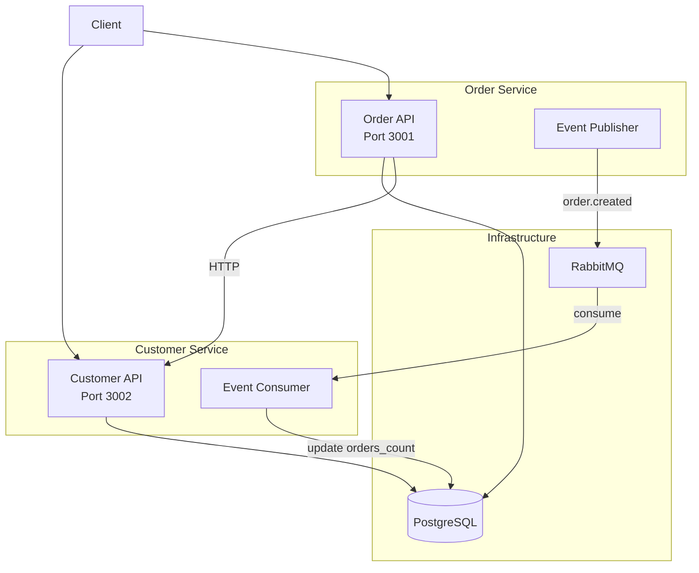
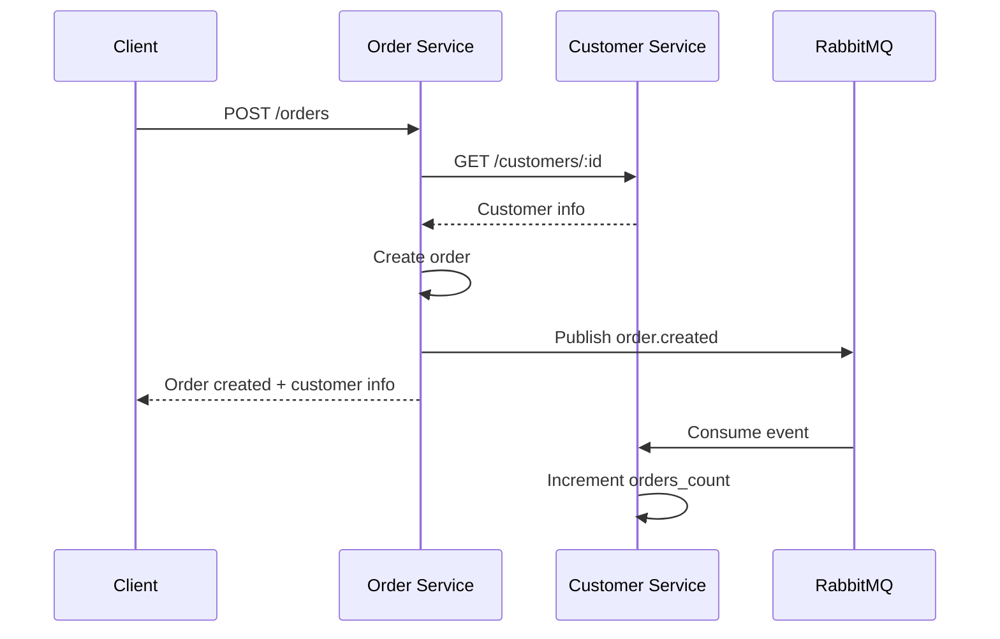

# Monokera Backend Challenge

Microservices architecture with two Rails 8 API services for order management.

## Architecture Overview



## Tech Stack

- **Ruby**: 3.3.0
- **Rails**: 8.0 (API mode)
- **Database**: PostgreSQL 16
- **Message Broker**: RabbitMQ 3.13
- **Testing**: RSpec, FactoryBot
- **Infrastructure**: Docker Compose, Terraform

## Quick Start

### Prerequisites

- Docker Desktop 4.0+
- Ruby 3.3.0+ (optional for local development)

### Setup

1. Clone the repository:
```bash
git clone <repository-url>
cd monokera-challenge
```

2. Copy environment files:
```bash
cp .env.example .env
```

3. Start infrastructure:
```bash
make up
```

4. Setup databases:
```bash
make setup-db
```

5. Verify services:
```bash
curl http://localhost:3001/health  # Order Service
curl http://localhost:3002/health  # Customer Service
```

## Services

### Order Service (Port 3001)

| Method | Endpoint | Description |
|--------|----------|-------------|
| POST | /api/v1/orders | Create new order |
| GET | /api/v1/orders | List all orders |
| GET | /api/v1/orders?customer_id=X | List orders by customer |
| GET | /api/v1/orders/:id | Get order details |
| GET | /health | Health check |
| GET | /health/rabbitmq | RabbitMQ connection status |

### Customer Service (Port 3002)

| Method | Endpoint | Description |
|--------|----------|-------------|
| GET | /api/v1/customers/:id | Get customer info |
| GET | /health | Health check |
| GET | /health/rabbitmq | RabbitMQ connection status |

## Event Flow



## Development

### Run Tests

```bash
# All tests
make test

# Order Service only
make test-orders

# Customer Service only
make test-customers

# Integration tests
make test-integration
```

### Linting

```bash
make lint
```

### Logs

```bash
make logs
```

## Project Structure

```
monokera-challenge/
├── services/
│   ├── order_service/       # Rails API for orders
│   └── customer_service/    # Rails API for customers
├── infrastructure/
│   └── terraform/           # AWS infrastructure
├── integration_tests/       # E2E tests
├── docker/                  # Dockerfiles
├── docs/                    # Documentation
├── docker-compose.yml
├── Makefile
└── README.md
```

## Deployment

See [Infrastructure Documentation](docs/infrastructure.md) for Terraform deployment instructions.

## API Documentation

See [API Documentation](docs/api.md) for detailed endpoint specifications.

## Event Catalog

See [Event Catalog](docs/events.md) for event schemas and routing.
